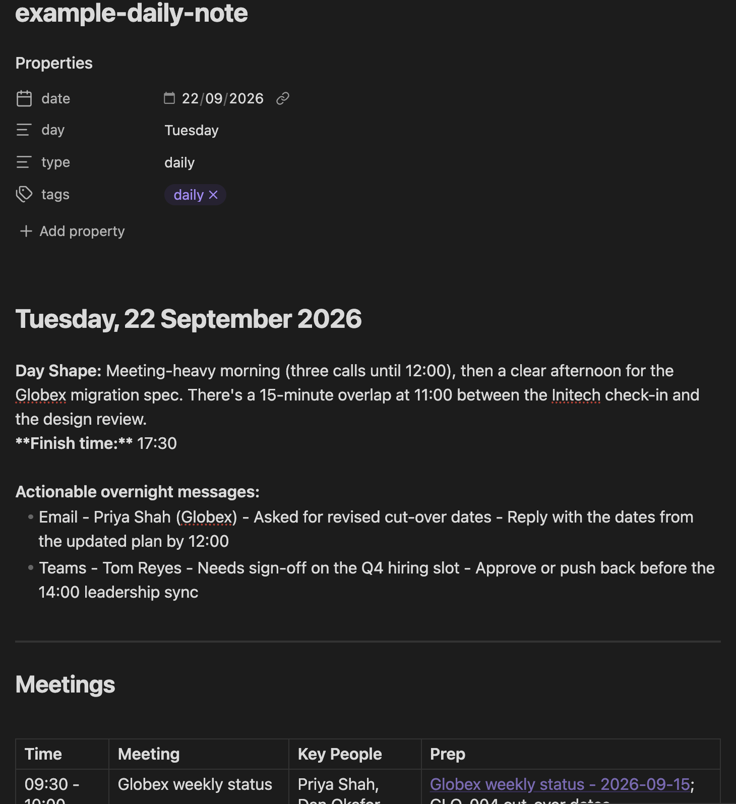
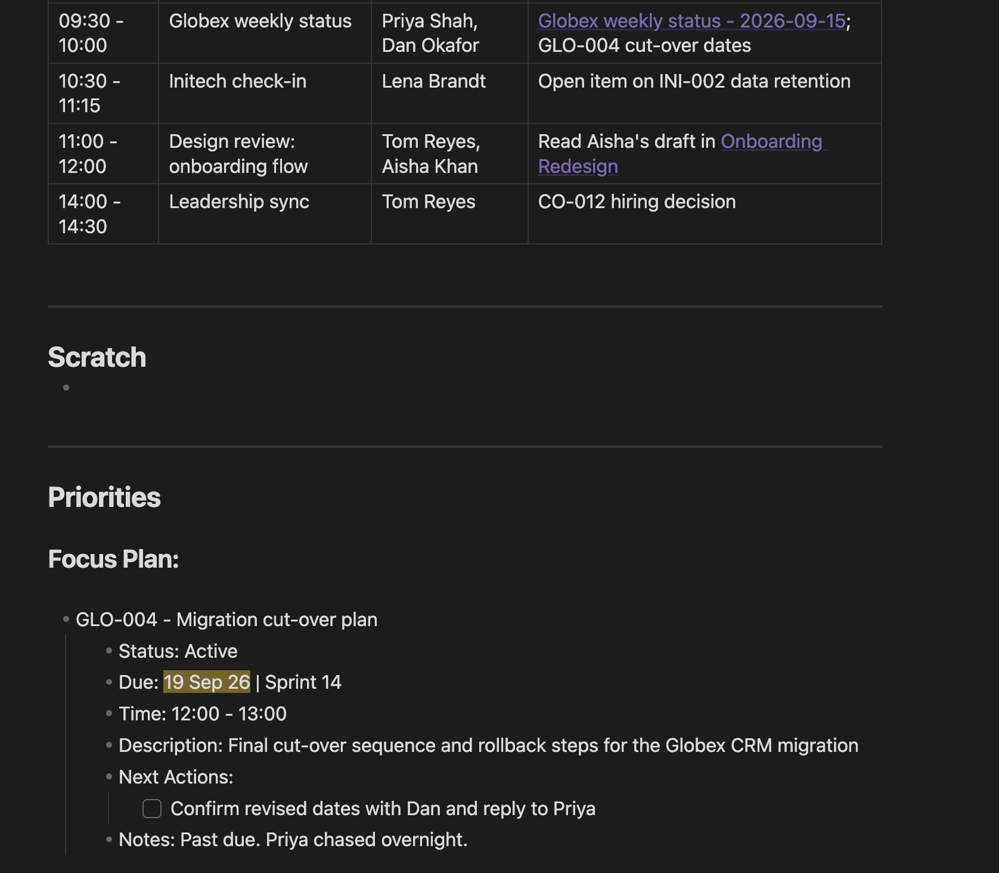

# Chief of Staff for Claude Code

An AI Chief of Staff, Executive Assistant and Mentor that run your working day out of an Obsidian vault, with optional calendar, email and Teams context from Microsoft 365.

Each morning it writes your daily note: your meetings, anything overnight that needs action, and a Focus Plan that fits your tasks into the gaps in your diary. At the end of the day it reconciles what actually happened, updates your task files and project notes, and rolls the leftovers into tomorrow. It also preps you for meetings, runs weekly and monthly reviews, and coaches you on your development.

Everything lives in plain markdown in your own vault. Nothing is sent anywhere except to Claude.



<details>
<summary>…and its Focus Plan</summary>



</details>

## What's included

| Type | Name | What it does |
|---|---|---|
| Agent | `ai-chief-of-staff` | Runs your day and owns all the routines below |
| Agent | `ai-executive-assistant` | Retrieves and summarises Teams conversations and files notes into the right vault page |
| Agent | `ai-mentor-and-coach` | Learning plans, skills-gap analysis, progress reviews, career decisions |
| Skill | `setup` | Interviews you, writes your config and scaffolds the vault |
| Skill | `morning-briefing` | Builds today's daily note, meetings, overnight actions and Focus Plan |
| Skill | `end-of-day-capture` | Reconciles the day, updates task files and project notes, rolls work to tomorrow |
| Skill | `commitments-review` | Walks every commitment with you; quick due-date edits |
| Skill | `meeting-prep` | Briefs you on a meeting from past notes and live commitments |
| Skill | `weekly-review` | What closed, what slipped, next week's top 3 |
| Skill | `monthly-review` | System-health audit of your tasks, projects, people and habits |

## Prerequisites

- [Claude Code](https://docs.claude.com/en/docs/claude-code)
- [Obsidian](https://obsidian.md) with a vault, which can be new or existing
- [Graphify](https://pypi.org/project/graphifyy/) — **required**. It keeps a knowledge graph of your vault so the agents find the right notes without loading whole folders, which keeps every routine fast and its context small. Install it before setup:
  ```bash
  uv tool install graphifyy        # or: pipx install graphifyy
  graphify install --platform claude
  ```
  Setup checks for it, offers to install it if it's missing, and offers to build your vault's graph.
- **Optional:** the Microsoft 365 connector, enabled at claude.ai → Settings → Connectors, for calendar, email and Teams. Without it, everything runs from the vault alone.

## Install

First time? [INSTALL.md](INSTALL.md) walks through everything, from logging in to connecting Microsoft 365. If you already have the prerequisites, run this in Claude Code:

```
/plugin marketplace add jrgreen284/claude-chief-of-staff
/plugin install chief-of-staff@chief-of-staff
```

Then, from your vault folder (or the folder above it):

```
/chief-of-staff:setup
```

Setup asks for your name, timezone, organisations, task files and Id prefixes. It checks Graphify is installed, writes `.cos/config.md` in your vault, creates any missing folders, templates, task files and people files, and offers to build the vault graph. **It never overwrites an existing file**, so it's safe to point at a vault you already use, and safe to re-run later to add an organisation or task file.

## Daily use

Start Claude Code in your vault folder and say:

| Say | Runs |
|---|---|
| "morning brief" | `morning-briefing` |
| "prep me for the steering group" | `meeting-prep` |
| "end of day" | `end-of-day-capture` |
| "review commitments" / "push CO-012 to Friday" | `commitments-review` |
| "weekly review" / "monthly review" | the review skills |
| "summarise my chat with Sam into the Relaunch page" | `ai-executive-assistant` |
| "help me build a learning plan for …" | `ai-mentor-and-coach` |

To make the Chief of Staff your main agent, so that it can delegate to the Executive Assistant:

```
claude --agent chief-of-staff:ai-chief-of-staff
```

If Claude Code runs somewhere other than the vault, name the vault path in your request, or set `COS_VAULT` to it and allow `Bash(printenv COS_VAULT)` in your permissions.

## How your vault is organised

The defaults are below. Setup maps them onto any folders you already have.

```
<vault>/
  .cos/config.md            your settings (edit any time)
  .cos/memory/              agent session notes
  0) Reference Files/       about-me.md, career-goals.md, Templates/
  1) Company/<Your org>/    people.md, Projects/
  2) Clients & Vendors/Clients|Vendors/<Org>/   people.md, Projects/
  3) Tasks & Actions/       one file per task list, plus a -archive sibling
  4) Learning/
  5) Daily/                 YYYY-MM-DD.md
  6) Meetings/              <Meeting> - YYYY-MM-DD.md
  7) Reviews/               week-YYYY-WNN.md, month-YYYY-MM.md
  graphify-out/             the vault knowledge graph
```

Task files share one table format:

`Id | Name | Priority | Status | Due Date - Sprint | Description | Next Action / Notes`

The Id prefix tells the agents which project folder the task belongs to. Company work uses `CO` (e.g. `CO-012`); each client or vendor gets its own prefix (e.g. `GLO-004` for Globex), so its project notes land in that organisation's folder.

## Keeping the graph fresh

The agents query the graph first and only fall back to searching files when it has no answer. Refresh it after a busy week, or whenever the monthly review flags it as stale:

```
/graphify . --update
```

Run it from the vault root. It only re-reads notes that changed.

## Permissions

The skills edit files in your vault. To avoid a prompt on every edit, allow it in `<vault>/.claude/settings.local.json`. Setup offers to do this for you.

```json
{
  "permissions": {
    "allow": ["Edit(/path/to/vault/**)", "Write(/path/to/vault/**)"]
  }
}
```

Microsoft 365 access is read-only. The agents never send, reply to, create or delete anything there.

## Scheduling (optional)

To run the morning brief unattended every weekday, point cron or launchd at:

```bash
#!/usr/bin/env bash
set -euo pipefail
cd "/path/to/vault"
claude -p "morning brief" --agent chief-of-staff:ai-chief-of-staff --permission-mode acceptEdits
```

Microsoft 365 connector availability in unattended runs depends on your Claude login. Check the first scheduled note to confirm the calendar was pulled.

## Privacy

Your notes stay in your vault. Claude reads what each routine needs in order to do its job. Put the rule for anything that must never appear in reviews or briefs, such as client commercial terms, in the `confidentiality` field of your config, and every routine will respect it.

## Updating

```
/plugin marketplace update chief-of-staff
```

Updates never touch your vault or your config.

## Contributing

Issues and pull requests are welcome. See [CONTRIBUTING.md](CONTRIBUTING.md).

## License

[MIT](LICENSE)
